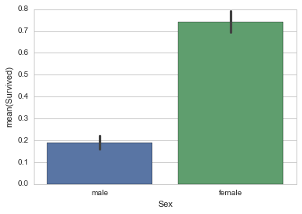
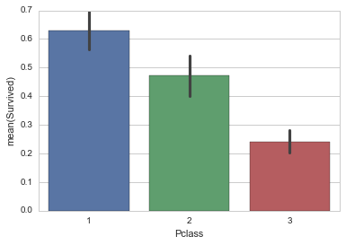
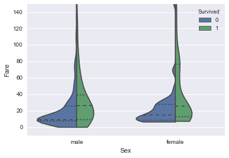
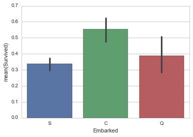
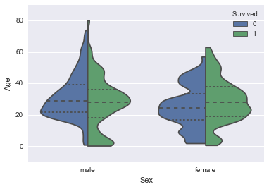
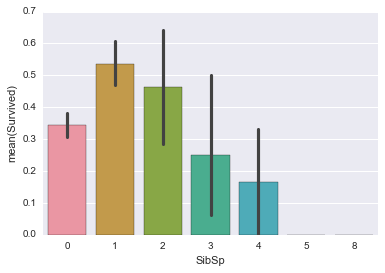

#Titanic-Kaggle
Titanic Kaggle dataset Model Comparison. The goal of this challenge is to use the provided dataset to predict weather a passenger survived the sinking of the Titanic. I decided to use this simple dataset to a compare of the performance of various algorithms, including logistic regression.

##Features
- VARIABLE DESCRIPTIONS:
- survival        Survival (0 = No; 1 = Yes)
- pclass          Passenger Class (1 = 1st; 2 = 2nd; 3 = 3rd)
- name            Name
- sex             Sex
- age             Age
- sibsp           Number of Siblings/Spouses Aboard
- parch           Number of Parents/Children Aboard
- ticket          Ticket Number
- fare            Passenger Fare
- cabin           Cabin
- embarked        Port of Embarkation
- Features included in model: pclass, sex, age, sibsp, parch, fare, cabin (letter prefix), embarked.

##Data Analysis

- Sex obviously has a strong signal, females are much more likely to survive.

- Passengers in a higher (closer to 1) Pclass were more likely to survive.

- Male and Female passengers who have a higher Fare are more likely to survive.

- Although people embarking at port C have a higher percentage of survival, I am suspect of this feature. Embarking port may only be correlated with wealth, which would be better indicated by Fare or Pclass.

- I do not see a strong connection between age and survival, but Male and Females bellow Age 10 may be more likely to survive.

- I did not find this SibSp a useful feature in making predictions.

##Algorithms
- LogisticRegression : 93.540670 %
- RandomForest : 80.382775 %
- GradientBoosting : 89.952153 %
- GNB : 67.942584 %
- DecisionTree : 84.928230 %
- AdaBoost : 90.669856 %

- Winner algorithm is LogisticRegression with a 93.540670 % success

*Update: I removed the features 'Age', 'Embarked', 'SibSp'. This improved the accuracy of all models when predicting on the test data. The removed features proved to be poor predictors and were causing overfitting to the training data. After tuning, reducing the number of estimators, GradientBoosting was the new winner.

- LogisticRegression : 95.454545 %
- AdaBoost: 92.822967 %
- RandomForest : 87.081340 %
- DecisionTree : 89.712919 %
- GradientBoosting : 98.803828 %

- Winner algorithm is GradientBoosting with a 98.803828 % success

##Conclusion
This dataset initially lends itself to a decision a tree type model, because many of the features are categorical and decision trees work appropriately with not-continuous values, while liner models would assume that Port "2" is two times greater than Port "1". However, I wanted to see how a liner model would preform and dummying the categorical features into multiple binary features was the obvious solution. It turned out that LogisticRegression* performed better than any of the decision tree algorithms. It is important to remember that the simplest algorithms sometimes perform the best.  (*Note: These models were not precisely tuned)

*Update: LogisticRegression appears to overfit less than decision tree algorithms, but preformed second best after the features Age, Embarked, and SibSp where removed. GradientBoosted trees became new winner at 98.8% accuracy. Two takeaways for this update are that poor features can cause overfitting to the training data and that some decision tree algorithms are more prone to overfitting.  
